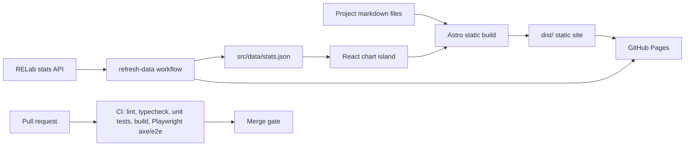

# Architecture

This is a small static portfolio site, not a general web platform. The architecture favours reproducible builds, low runtime complexity, and enough automation to keep the public page honest.

## Runtime shape

- Astro renders the page statically.
- Project cards come from the typed content collection under `src/content/projects/`.
- The only client-side island is `DisassemblyChart.tsx`, which hydrates when visible so users can switch between RELab measures.
- The chart also renders a visually hidden table, so the same data is available without depending on SVG inspection.

## Data refresh

`src/data/stats.json` is committed because GitHub Pages serves a static build. The scheduled `refresh-data.yml` workflow runs `scripts/fetch-stats.mjs`, validates that the public RELab `/stats` response still has the fields the chart reads, commits the new snapshot if it changed, then deploys.

If the API is unavailable, blocked, or returns an unexpected shape, the script exits successfully without touching the snapshot. That keeps the last known-good build online and avoids silently rendering zeros.

## Deployment and checks

Pull requests run `pnpm check`, a production Astro build, and Playwright tests with axe accessibility scans. Merges to `main` deploy through GitHub Pages. The refresh workflow shares the same Pages concurrency group as the normal deploy workflow so deployments queue instead of racing.

## Deliberate non-goals

- No backend for the portfolio site.
- No runtime database; research datasets and platform data live in their own repositories/services.
- No release changelog for the site itself; changes are tracked through Git history and pull requests.
